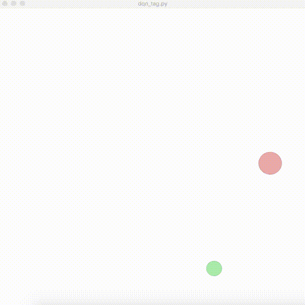
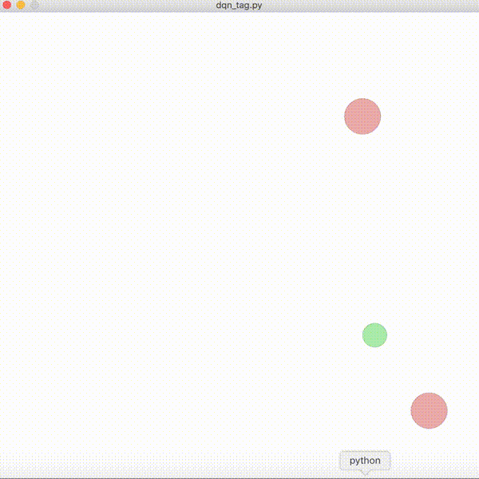
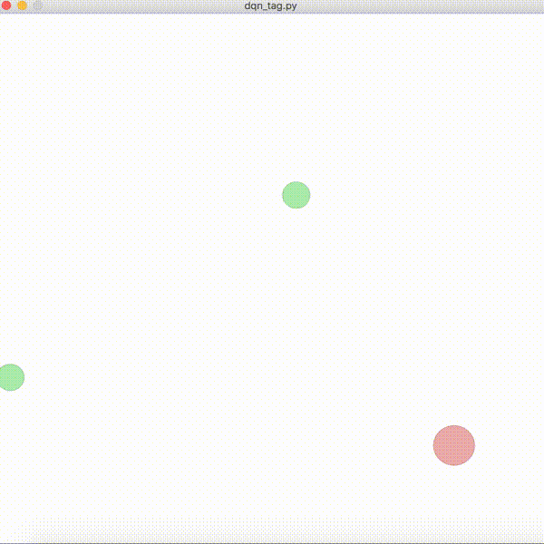

# Multi-Agent Reinforcement Learning

[DQN](https://www.cs.toronto.edu/~vmnih/docs/dqn.pdf), [DDPG](https://arxiv.org/abs/1509.02971) and [MADDPG](https://arxiv.org/abs/1706.02275) to play tag in OpenAI's [multi-agent particle environment](https://github.com/openai/multiagent-particle-envs)

1 vs 1 | 1 vs 2 | 2 vs 1
:-----:|:------:|:-------:
 |  | 
